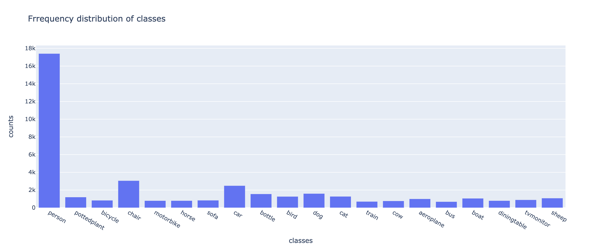
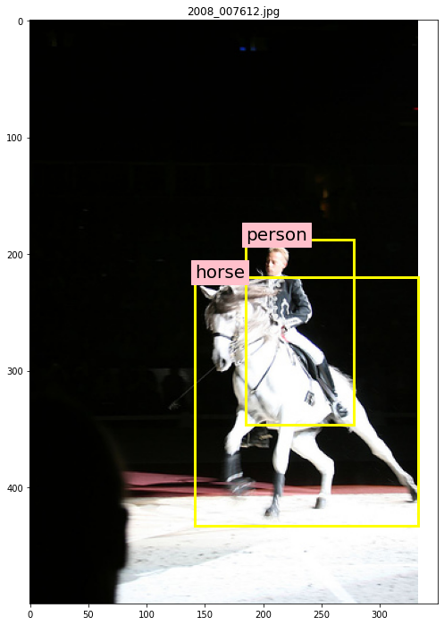
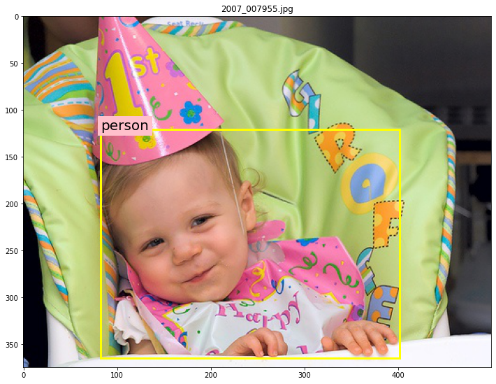
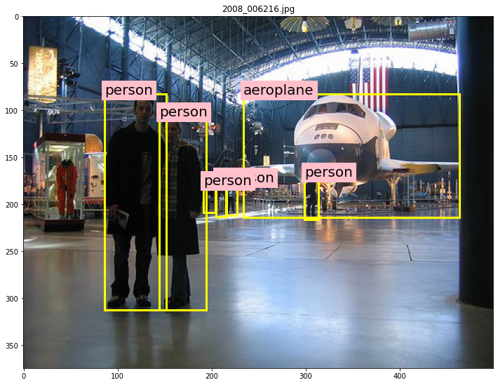
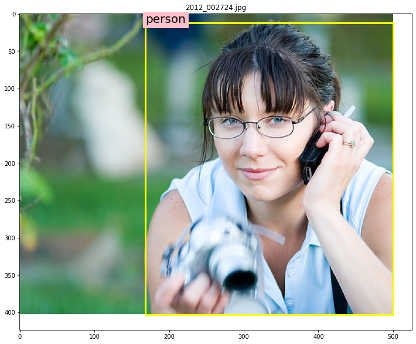
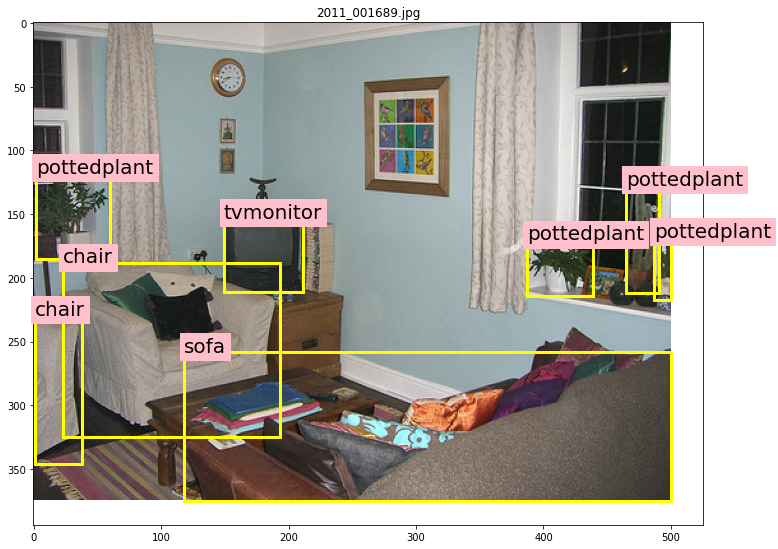
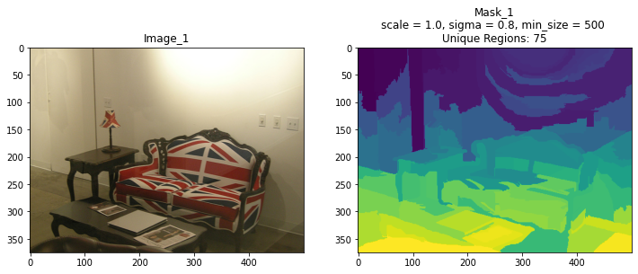
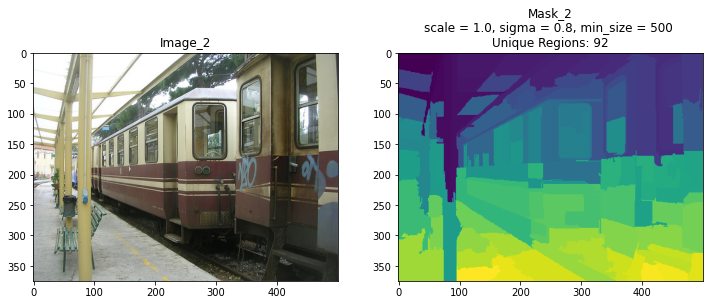
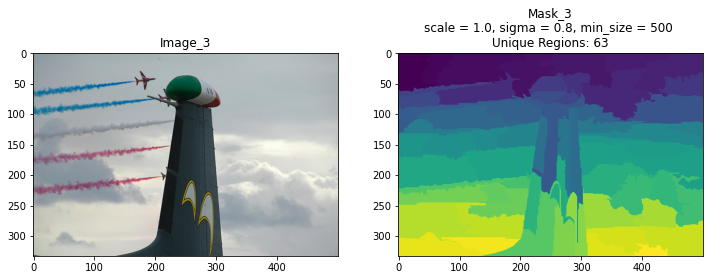
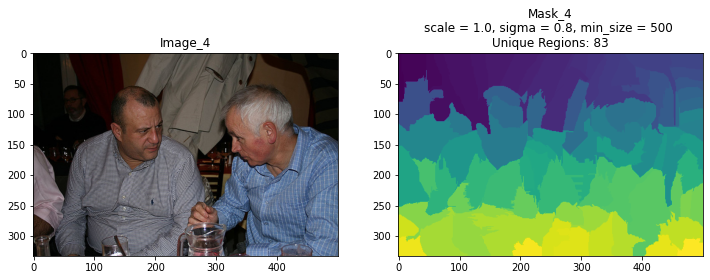

# RCNN (Ongoing)

Tensorflow implementation of the RCNN object detection system as proposed by [Rich feature hierarchies for accurate object detection and semantic segmentation
](https://arxiv.org/abs/1311.2524).

**Test Notebook:** [RCNN_Notebook.ipynb](https://mybinder.org/v2/gh/soumik12345/RCNN/master?filepath=notebooks%2FRCNN_Notebook.ipynb)

## Pascal VOC2012

### Number of Objects per Image

### Frequency Distribution of Classes

### Sample Images + Ground Truth

## Selective Search

### Felzenszwalb Segmentation

