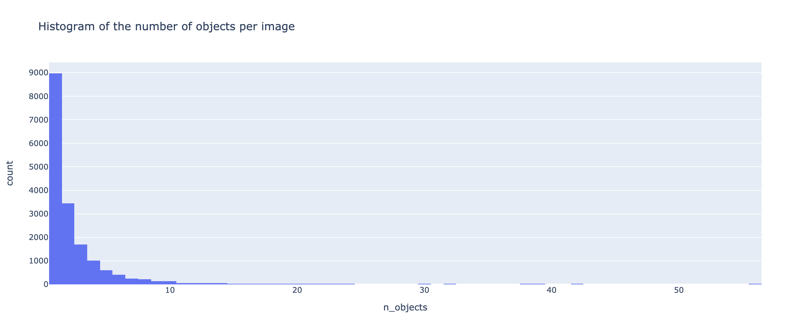

# RCNN (Ongoing)

Tensorflow implementation of the RCNN object detection system as proposed by [Rich feature hierarchies for accurate object detection and semantic segmentation
](https://arxiv.org/abs/1311.2524).

## Pascal VOC2012

### Number of Objects per Image

### Frequency Distribution of Classes

### Sample Images + Ground Truth

